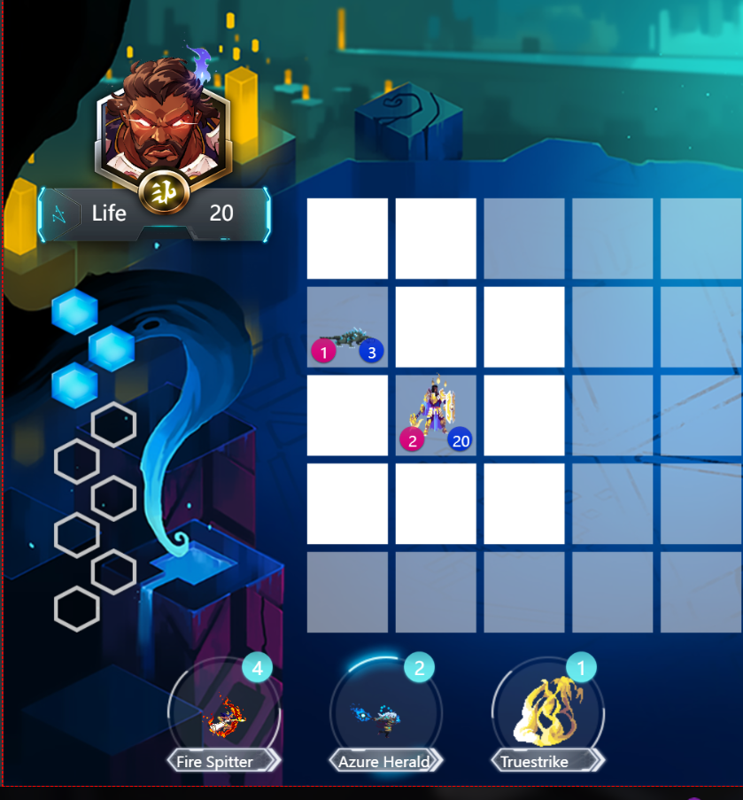
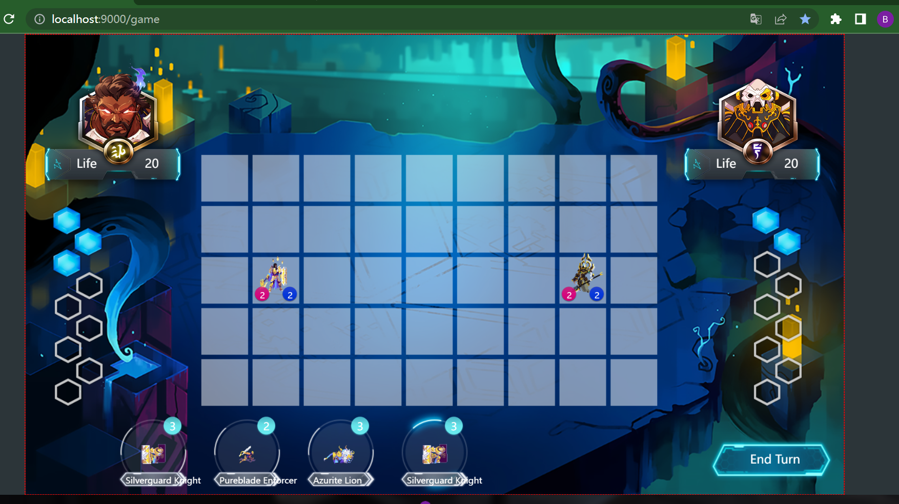

# MSc IT+ Masters Team Project 
The goal of this software development project is to produce an online ‘tactical’ card game which combines card-game mechanics with a chess-like board. **The project uses Java to develop the core back-end service in Java that manages and progresses the game as the player takes actions in a Web browser.** The final product should enable a human player to complete a game with a (semi-)intelligent AI opponent.

**Project duration:** January 9th, 2023 - 10th March, 2023  
**Project Members**: Bingcen Luo, Peiyuan Shi, Haoyang Yu, Yiming Zhou, Jiasong Liu  
**Tutor:** Dr Richard McCreadie
***


# Development Pre-configuration Requirements

 
Before starting your development, ensure you meet the following requirements:

-   **Java Version**: An older version of Java is required for SBT functionality (tested with OpenJDK 11). Note that the template is not compatible with Java 16.
-   **Scala Plugin for IntelliJ IDEA**: Before creating a Play application in IntelliJ IDEA, ensure the latest [Scala Plugin](https://www.jetbrains.com/idea/help/creating-and-running-your-scala-application.html) is installed and enabled. This is essential even if you do not develop in Scala, as it aids in template engine, dependency resolution, and project setup.

### Creating a Play Application

To start a new Play application, follow these steps:

1.  Open the **New Project** wizard, select **sbt** under the **Scala** section, and click **Next**.
2.  Enter your project’s information and click **Finish**.

### Importing an Existing Play Project

If you have an existing Play project, you can import it as follows:

1.  Open the Project wizard, select **Import Project**.
2.  In the opening window, select the project you wish to import and click **OK**.
3.  On the next page of the wizard, choose the **Import project from external model** option, select **sbt project**, and click **Next**.
4.  Select additional import options on the following page and click **Finish**.

### Running Your Application

To run your created application and view it in the default browser ([http://localhost:9000](http://localhost:9000/)), follow these steps:

1.  Create a new Run Configuration – From the main menu, select **Run** -> **Edit Configurations**.
2.  Click on the + to add a new configuration.
3.  Choose “sbt Task” from the list of configurations.
4.  In the “tasks” input box, simply put “run”.
5.  Apply changes and select **OK**.
6.  Now, you can choose “Run” from the main Run menu to launch your application.

### All Scala Plugins if needed
1.  Eclipse Scala IDE:  [http://scala-ide.org/](http://scala-ide.org/)
2.  NetBeans Scala Plugin:  [https://github.com/dcaoyuan/nbscala](https://github.com/dcaoyuan/nbscala)
3.  IntelliJ IDEA Scala Plugin:  [https://blog.jetbrains.com/scala/](https://blog.jetbrains.com/scala/)
4.  ENSIME - Scala IDE Mode for Emacs:  [https://github.com/ensime/ensime-emacs](https://github.com/ensime/ensime-emacs)

### 文件目录结构

```
filetree 
├── app
│   ├── actors	//Main communication class, responsible for receiving events
│   ├── assets	//Contain JavaScript and images. You shouldn't need to edit anything!
│   ├── commands	//Contains basic commands and classes
│   ├── controllers	//Responsible for creating game actors
│   ├── demo	//Includes command demos showing how to use all the different commands
│   ├── events	
│   ├── structures	//Contains pre-provided basic objects
│   ├── utils
│   └── views
├── README.md

```

# Game Basic Information


### Game Rules
**The game  is a browser-game 1 player tactical card game**
• Browser Game: Played via interaction with a Web browser (e.g Chrome, Firefox, Edge, etc.)
• 1 Player: A human player plays against an AI opponent
• Tactical Card Game
• Each Player starts with a deck of cards, a heath pool and resource pool
• Players take turns, each turn:
• The active player draws a card
• Uses resources to play one or more cards (to summon units, or affect the board)
• Activate units on the board (to have them move and attack)
• The first player to reach 0 heath loses A card has five key components to it:
• Name (a unique name)
• Description (affects or ability descriptions)
• Resource cost (what is needed to play the card)
• Attack (if a creature, how much damage does it do when attacking)
• Health (if a creature, how much damage in total will it need to take before being destroyed  

**Unit Movement**
• During a turn where the unit started on the board that turn (or has the rush ability), can make a single
move
• A unit by default can move two tiles in any of the four cardinal directions or one tile diagonally
• Units cannot leave the board  
**Attacking**
• Either before or after a move the a unit can attack an enemy unit
• A unit by default can attack any enemy unit in an adjacent tile
• Units can attack diagonally
• If a unit attacks and has not moved, it forfeits its ability to move  
**Dealing Damage**
• When a unit attacks, it reduces its defending targets health by a number equal to the attacking unit’s attack statistic
• If the defender survives (has more than 0 health), the defending unit then counter-attacks*, reducing the attacking units health by the defending units attack statistic
• *assuming its in range without needing to move  
**Playing Cards**
• At any point during the active player’s turn they can play a card
• To play a card, they need to have sufficient resource (mana) and have one or more valid targets
• Playing a card often requires targeting a tile on the board
• The majority of cards are creature cards, i.e. they summon a unit on the board
• Units can be summoned on any adjacent tile to a friendly unit  
**Spells**
• Spells are a catch-all term for cards that do not summon units
• They will usually target a friendly or enemy unit on the board
• The card description specifies what happens when the card is played and valid target groups (if any)  
```
How does counter-attacking work?

-   When a unit attacks, it reduces the health of the unit it attacked by its 'attack value'
-   If the unit that was attacked is still alive (has greater than 0 health) it counter attacks
-   This means that it then immediately reduces the health of the original attacker by its 'attack value'
-   This is the end of the attack action (counter-attacks are not recursive)
-   A unit can only counter attack once per player turn

What happens if I run out of cards in my deck?

-   If you draw a card and you have no cards remaining you lose the game

Tell me about hand size

-   The maximum hand size is 6
-   If you draw a card it is inserted into your hand (you may choose to sort the players hand, but this is not required)
-   Drawing a card happens at the end of the player's turn when they press the end-turn button
-   If you draw a card and your hand is full, you discard (lose) that card

Can you clarify what a unit can do on a turn?

-   If a unit has just been summoned, it cannot take any actions that turn
-   If a unit started the turn on the board, then it has an available 'attack action' and an available 'move action' that it can spend before the end of the turn
-   A unit can spend its move action, followed by its attack action (either as a single move-then-attack or as separate actions)
-   If a unit attacks and has not moved it loses its move action that turn.
-   A unit that has attack twice has two attack actions in a turn rather than one.

Can multiple units act in a turn?

-   Yes
```


# Screenshots
    
